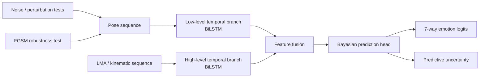

# Robust Bodily Emotion Recognition with Hybrid Bayesian LSTM

[](https://doi.org/10.1016/j.aiopen.2025.09.002)


**Hybrid Bayesian LSTM for robust bodily emotion recognition using pose and Laban Movement Analysis**

Research project accompanying:

**Shuang Wu and Daniela M. Romano**  
*Robust emotion recognition using hybrid Bayesian LSTM based on Laban movement analysis*  
**AI Open (2025)**  
DOI: https://doi.org/10.1016/j.aiopen.2025.09.002

> **Public-code note:** this repository contains a compact PyTorch reference implementation reconstructed around the published modelling ideas. It is intended to communicate the temporal, feature-fusion, Bayesian, and robustness components clearly; it is **not** represented as the exact internal codebase used to generate every result in the paper.

## Why this problem?

Body motion carries affective information, but recognition models must remain reliable when pose observations are noisy, incomplete, or shifted away from controlled recording conditions.

This project combines:

- **low-level pose dynamics**,
- **higher-level Laban / kinematic descriptors**,
- **temporal sequence modelling**,
- and **Bayesian predictive uncertainty**

to support more robust bodily emotion recognition.

## Method at a glance



The public implementation exposes a compact version of this design:

1. **Low-level branch** — models pose trajectories with a bidirectional LSTM.
2. **High-level branch** — models LMA / kinematic descriptors with a second temporal encoder.
3. **Feature fusion** — combines both temporal representations.
4. **Bayesian head** — uses variational linear layers to produce stochastic predictions and a KL regularisation term.
5. **Robustness utilities** — provide Gaussian-noise and FGSM perturbation examples.

## Public reference implementation

| Component | Included |
| --- | --- |
| Pose-sequence BiLSTM | ✓ |
| LMA / kinematic BiLSTM | ✓ |
| Feature fusion | ✓ |
| Bayesian linear classifier | ✓ |
| Monte Carlo predictive uncertainty | ✓ |
| Gaussian-noise perturbation | ✓ |
| FGSM perturbation | ✓ |
| Synthetic inference demo | ✓ |
| One-step training smoke test | ✓ |
| Restricted research datasets | Not redistributed |
| Paper checkpoints | Not redistributed |
| Exact private experiment orchestration | Not redistributed |

## Repository structure

```text
.
├── .github/
│   └── workflows/
│       └── smoke-test.yml
├── configs/
│   └── example.yaml
├── demo/
│   └── inference_demo.py
├── src/
│   ├── features/
│   │   └── lma.py
│   ├── models/
│   │   ├── bayesian.py
│   │   └── hbp_lstm.py
│   ├── robustness/
│   │   ├── attacks.py
│   │   └── noise.py
│   └── utils/
│       └── metrics.py
├── tests/
│   └── test_shapes.py
├── CITATION.cff
├── MODEL_CARD.md
├── train_reference.py
├── requirements.txt
└── README.md
```

## Installation

```bash
git clone https://github.com/296466042Shuang/hbp-lstm-emotion-recognition.git
cd hbp-lstm-emotion-recognition
pip install -r requirements.txt
```

Python 3.10+ and PyTorch are recommended.

## Quick start

Run a deployment-style forward pass with synthetic pose and LMA / kinematic inputs:

```bash
python demo/inference_demo.py
```

Run a single synthetic optimisation step including the Bayesian KL term:

```bash
python train_reference.py
```

These are **smoke tests for the public reference implementation** and are not intended to reproduce the exact benchmark values reported in the paper.

## Core model interface

```python
from src.models.hbp_lstm import HBPLSTM

model = HBPLSTM(
    num_joints=17,
    coord_dim=3,
    high_level_dim=33,
    num_classes=7,
)

output = model(pose_sequence, lma_sequence, sample=True)

logits = output["logits"]
kl = output["kl"]
```

For uncertainty-aware prediction:

```python
summary = model.predict_mc(
    pose_sequence,
    lma_sequence,
    samples=20,
)

mean_probability = summary["mean_probability"]
predictive_entropy = summary["predictive_entropy"]
```

## Robustness examples

Gaussian perturbation:

```python
from src.robustness.noise import add_gaussian_noise

noisy_pose = add_gaussian_noise(pose_sequence, sigma=0.02)
```

FGSM perturbation:

```python
from src.robustness.attacks import fgsm_pose_attack

adversarial_pose = fgsm_pose_attack(
    model,
    pose_sequence,
    lma_sequence,
    labels,
    epsilon=0.01,
)
```

## Public-release boundary

### Included

- compact temporal encoders;
- low-/high-level feature fusion;
- variational Bayesian prediction layer;
- uncertainty estimation by Monte Carlo sampling;
- generic robustness perturbations;
- synthetic examples and tests.

### Not included

- restricted or licensed raw datasets;
- paper-trained weights;
- private preprocessing / cluster infrastructure;
- exact experiment scheduling and ablation code;
- any data that could identify research participants.

## Broader sensing perspective

Although the application here is bodily emotion recognition, the modelling question is broader: **how can a temporal model remain reliable when the observed signal is noisy, perturbed, or only partially informative?**

That motivation connects this work to later research on privacy-constrained sensing, privileged supervision, multimodal representation learning, and recoverability under weak observations.

## Citation

```bibtex
@article{wu2025robust,
  title={Robust emotion recognition using hybrid Bayesian LSTM based on Laban movement analysis},
  author={Wu, Shuang and Romano, Daniela M.},
  journal={AI Open},
  year={2025},
  doi={10.1016/j.aiopen.2025.09.002}
}
```

Machine-readable metadata are also provided in `CITATION.cff`.

## Authors

**Shuang Wu** — University College London (UCL)  
**Daniela M. Romano**

## Licence

No blanket software licence is granted yet. A licence will be added after the public release has been checked for third-party code and data dependencies.
